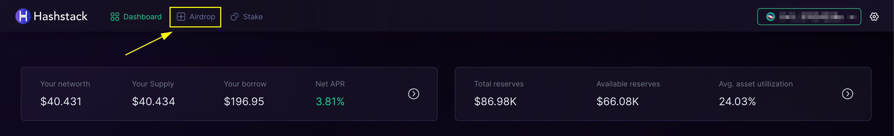

# ❓ Airdrop FAQ

**Q. Where can I see the airdrop campaign page?**

* You will be able to access the airdrop campaign page from the navbar after you complete 1 transaction on the Mainnet V1.

<figure><figcaption></figcaption></figure>

**Q. How do I get access to the mainnet?**

* Visit [#request-v1-access](https://discord.com/channels/907151419650482217/1176491088459071528) in our discord and get the link.

**Q. I cannot see my real time points.**

* Kindly give it a couple of minutes. Sometimes there may be a latency in fetching on-chain data

**Q. Where can I see the protocol metrics?**

* Use this link: [https://app.hashstack.finance/v1/protocol-metrics/](https://app.hashstack.finance/v1/protocol-metrics/)

**Q. When does my position get liquidated?**

* If current collateral + debt value ≤ 1.06 x debt actual.
* The loan health indicator shows whether your loan is currently healthy or facing potential liquidation. It is represented by a color code - green indicates good health, while red indicates that its nearing liquidation. The picture below represents a healthy loan position.

<figure><figcaption></figcaption></figure>

**Q. What are V1OG NFTs?**

* V1OG NFTs are the NFTs which provides additional rewards in campaigns and a lot more benefits. It will be issued to active community contributors, power users and ecosystem partners. It stands for "Version 1 Original Gangster".

**Q. What is the minimum amount required for supply and borrow?**

* supply: $25 equivalent
* borrow: $100 equivalent
