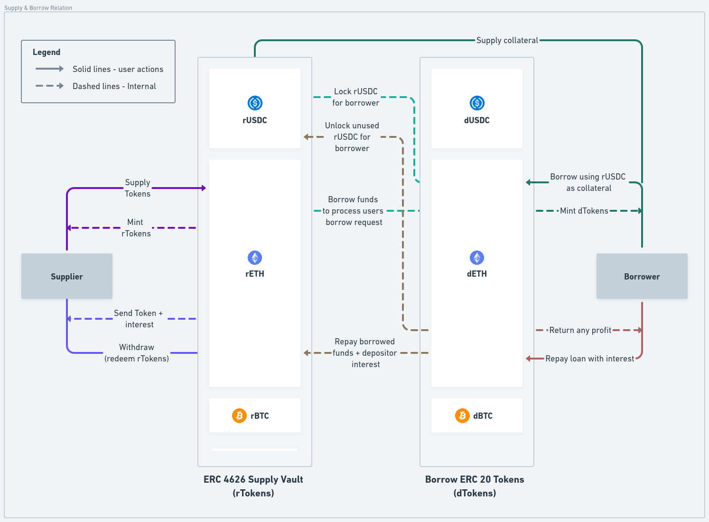

# Introduction

The protocol allows anyone to be a supplier. These supplied funds are then used to issue loans for the borrower. We make use of the ERC 4626 standard for our supply vault. When a user deposits funds to the corresponding vault, rTokens of that particular asset (Representational tokens) are minted to the user. These rTokens represent user shares in the deposit vault. We follow a similar logic in borrow token contract, though it is not designed to follow the 4626 standard (as it is not a vault). User will receive dTokens (Debt tokens) for borrowing and these tokens represent the share of total debt owed by the user to the protocol.

<figure><figcaption>
Fig. 1 - Interaction between supply and borrow contracts
</figcaption></figure>

The above diagrams describe the basic actions a supplier and borrow can do. It shows how to borrow and supply contracts interact with each other.
