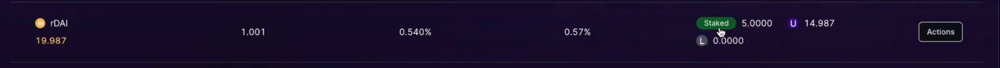

# Unstaking rTokens

Here are the steps:

1. To stake your rTokens, you can click on "Stake" located in the nav bar. Alternatively, you can click on "Details" on the supply section of the market dashboard.

<figure><figcaption></figcaption></figure>

This is how staked tokens look like:

<figure><figcaption></figcaption></figure>

2. Choose the option of Unstake, the supply market and the amount of tokens to be unstaked. After checking everything, click on "Unstake".

<figure><figcaption></figcaption></figure>

3. After clicking on the “Unstake” button, you need to sign the transaction in your wallet by clicking on “Sign”.

<figure><figcaption></figcaption></figure>

4. If there are no issues, then it will showcase the success notification.

<figure><figcaption></figcaption></figure>

###

### Video tutorial on Unstaking



