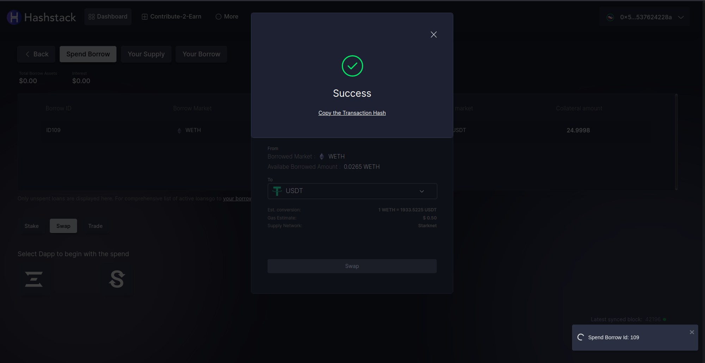

# Performing swap actions

1. Go to “Your borrow” tab from the dashboard and click on “Actions” button for the respective chosen borrow.

.png>)

2 (a). On the popup tab, choose “Spend Borrow” option under the Borrow Actions tab.

.png>)

2 (b). Alternatively, you can go to “Spend Borrow” tab from the Dashboard itself and choose the particular borrow which you want to spend. Next, select “Swap” and the dApp to swap your borrowed token.

<figure><figcaption></figcaption></figure>

3. Select “Swap” from the drop down and choose the dApp - JediSwap or mySwap.

.png>)

4. Select the token you have to swap with and click on “Swap”. For this demo, we will swap our wETH with USDT on mySwap.

.png>)

5. Approve the transaction.

.png>)

6. If there are no issues, then it will showcase the success notification.

<figure><figcaption></figcaption></figure>

7. Go to “Your Borrow” page, you can see that the loan is swapped.

<figure><figcaption></figcaption></figure>
