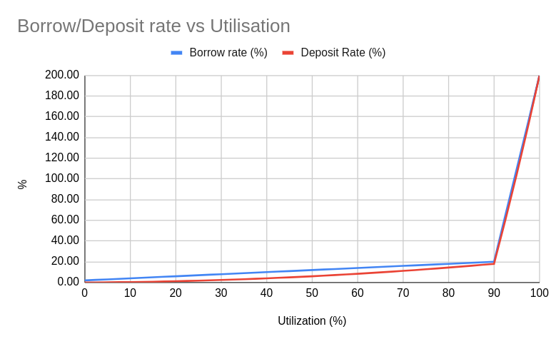

# Interest Rate Model

The Open protocol uses a dynamic interest rate model that ensures that the interest offered to the liquidity providers is always lower than the interest gained from the borrowers. The variability between the interest rates of the borrowers and the liquidity providers ensures that the protocol is always profitable and can pay the liquidity providers on time.

Hashstack has made the following considerations while designing the Interest rate algorithm of the Open protocol -

* Providing stable returns
* Promoting even-play among lenders and borrowers.
* The interest rate truly reflects the supply and demand of the underlying asset.

The interest rate model depends on reserves utilization factor and is designed to be in 3 parts:

1. Optimal utilization $$(Ut_{opt})$$: This is the ideal point for the utilization to be in. The curve is designed to vary linearly from a base borrow APR $$(APR_{base}$$ \[at 0 $$Ut])$$ to a max Ideal APR $$(APR_{Ut_{opt}}$$ at optimal utilization.
2. Higher Utilization: When the utilization exceeds $$Ut_{opt}$$, the APR is designed to increase rapidly to punish borrowing. This is done to ensure there is always enough un-used supply to cater for withdrawals.

<figure><figcaption></figcaption></figure>

$$Ut = \frac{Debt_{total}}{Supply_{total}}$$

$$APR_{brw} = \left\{ 	\begin{array}{ll} 		APR_{base} + (\frac{Ut}{Ut_{opt}}) \times (APR_{Ut_{opt}} - APR_{base}) & ; Ut \leq Ut_{opt} \\ 		APR_{opt} + (\frac{Ut - Ut_{opt}}{100-Ut_{opt}}) \times (APR_{Ut_{max}} - APR_{opt}) & ; Ut > Ut_{opt} 	\end{array} \right.$$

Where,

$$APR_{brw} =$$ Borrow APR

$$Ut =$$ Current Utilization rate

$$APR_{Ut_{max}} =$$ APR at 100% Ut

(Other variables defined above)

#### Example Math

Assume the following parameters:

$$APR_{base} = 2$$ (%)

$$APR_{opt} = 20$$ (%)

$$APR_{Ut_{max}} = 100$$ (%)

$$Ut_{opt} = 90$$ (%)

***

**Utilization: 10%**

Since $$Ut < Ut_{opt},$$

$$APR_{brw} = 2 + (\frac{10}{90}) \times (20-2)$$ = 4 %

***

**Utilization: 90%**

Since $$Ut = Ut_{opt},$$

$$APR_{brw} = 2 + (\frac{90}{90}) \times (20-2)$$ = 20 %

***

**Utilization: 95%**

Since $$Ut > Ut_{opt},$$

$$APR_{brw} = 20 + (\frac{95-90}{100-90}) \times (100-20)$$ = 60 %

